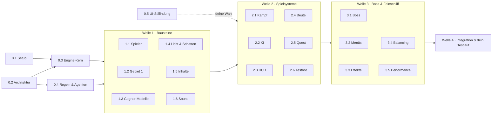

# Zauberstäbe – Plan bis zum ersten spielbaren Gebiet

> Stand: 06.10.2026 · Status: **freigegeben, Welle 0 läuft**
> Ziel: ein kleines, komplett spielbares Gebiet (ca. 10–15 Minuten Spielzeit), das du im Browser testen kannst.
> Deine Antworten auf Abschnitt 8 sind eingearbeitet (siehe dort und in `CLAUDE.md`).

## Kurzfassung

- **Was am Ende steht:** Du startest im Lager am Lagerfeuer und findest eine alte Schriftrolle, die du nicht lesen kannst. Über das Wegekreuz geht es Richtung Wald, durch drei kleine Kämpfe bis zum Rudelführer Grimmzahn.
- **Wie wir dahin kommen:** 5 Wellen (0–4). Innerhalb einer Welle arbeiten mehrere KI-Agenten **gleichzeitig** an getrennten Bausteinen. Danach führe ich alles zusammen, teste es und zeige dir den Stand.
- **Wer was macht:** **Opus** übernimmt knifflige Systeme (Architektur, Kampf, KI, Boss, Grafik), **Sonnet** klar umrissene Umsetzung (Oberfläche, Inventar, Quests, Sound, Tests). Haiku nur für Kleinkram, Fable nur als Joker bei festgefahrenen Problemen.
- **Wann du testen kannst:** kurze Zwischentests nach Welle 1 (herumlaufen) und Welle 2 (kämpfen, Beute), der komplette Testlauf nach Welle 4.
- **Was ich von dir brauche:** Freigabe, Antworten auf ein paar kurze Fragen ([Abschnitt 8](#8-was-ich-von-dir-brauche)) und einmal GitHub Pages einschalten.

---

## 1. Der Testlauf aus Spielersicht

1. **Titelbild** → „Neues Spiel“.
2. **Erwachen im Lager.** Abenddämmerung, das Feuer knistert, daneben Zelt und Rucksack. Nach einem kurzen Einstiegstext folgen Hinweise zur Steuerung (laufen, zielen, zaubern, interagieren).
3. **Die alte Schriftrolle.** Sie liegt neben dem Feuer. Aufheben (E) öffnet ein Pergament voller fremder Runen. Lesen kann man sie nicht, nur ein paar Zeichen glimmen schwach.
   Die Quest **„Die unleserliche Schriftrolle“** startet: *Finde jemanden, der die alte Schrift entziffern kann – vielleicht im Dorf.*
4. **Das Wegekreuz.** Ein Wegweiser mit drei Armen:
   - **Dorf**: Die Brücke über die Schlucht ist eingestürzt. Ein Schild sagt: *„Umweg durch den Wald“*.
   - **Berge**: Ein Erdrutsch versperrt den Pass (später zugänglich).
   - **Wald**: offen. Die Quest aktualisiert sich zu *„Nimm den Umweg durch den Wald.“*
5. **Der Weg zum Wald.** Drei kleine Kämpfe, die nacheinander etwas beibringen:
   - **Kampf 1:** zwei Wölfe (Feuerball)
   - **Kampf 2:** Wölfe und ein Irrlicht, das aus der Ferne schießt (ausweichen, Frostnova)
   - **Kampf 3:** ein Rudel an einer alten Ruine, dazu eine Truhe mit dem ersten magischen Stab
6. **Bosskampf auf der Waldlichtung: Grimmzahn, der Rudelführer.** Dornenranken schließen die Arena. Seine Angriffe kündigen sich mit Warnmarkierungen am Boden an, wie in WoW:
   - **Prankenhieb:** Kegel vor ihm
   - **Sprungangriff:** roter Kreis, wo er landen wird
   - **Rudelruf:** bei 66 % und 33 % Leben kommen Wölfe dazu
   - **Raserei:** unter 25 % Leben wird er schneller
7. **Sieg.** Du bekommst garantiert einen seltenen Zauberstab (z. B. *„Feuerball verschießt 2 zusätzliche Geschosse“*) und einen Wargzahn, und du steigst eine Stufe auf. Eine Rune auf der Schriftrolle glimmt auf, als Ausblick auf die Fortsetzung. Danach folgt der Endbildschirm: *„Ende des Testlaufs – Fortsetzung: Das Dorf“*, mit einem Knopf für Feedback.
8. **Tod:** Du erwachst wieder am Lagerfeuer, dem Speicherpunkt.

### Gebietsskizze

```
                        Berge
               (Erdrutsch – gesperrt)
                          ▲
                          │
  Wald ◄──K3────K2────K1──◆─────────► Dorf
 (Boss-                   │       (Brücke eingestürzt)
 lichtung)                │
                      ┌───┴───┐
                      │ Lager │  ← Start: Lagerfeuer, Zelt, Schriftrolle
                      └───────┘

  ◆ = Wegekreuz mit Wegweiser    K1–K3 = Kämpfe
```

Das Gebiet ist etwa 150 × 100 m groß, also in wenigen Minuten zu Fuß durchquert.

---

## 2. Umfang

### Drin

| Bereich | Im ersten Gebiet |
| --- | --- |
| Steuerung | WASD laufen, Maus zielen, Leertaste ausweichen, E interagieren |
| Zauber | Feuerball (linke Maustaste), Frostnova (rechte Maustaste), Ausweichrolle (Leertaste) |
| Gegner | Wolf (schnell, im Rudel), Warg (zäh, Ansturm), Irrlicht (schwebt, Fernkampf), Boss Grimmzahn |
| Beute | Zauberstäbe aus deiner Zauberstabliste (Holz, Kern und Länge bestimmen die Werte), Seltenheiten, Gold, Tränke, Wargzahn |
| Charakter | Stufe 1–4, Leben, Mana und Zauberkraft wachsen |
| Quest | 1 Hauptquest mit 5 Schritten, Questlog und Questanzeige |
| Interaktion | Schriftrolle, Wegweiser, Lagerfeuer (heilen, Speicherpunkt), Truhe |
| Oberfläche | komplett neu im Stil, den du aussuchst: HUD, Inventar, Tooltip, Pergament-Fenster, Menüs |
| Ton | Geräusche für Zauber, Treffer und Umgebung (Feuer, Wind, Wald), noch keine Musik |
| Technik | läuft in Chrome, Edge und Firefox, Ziel 60 FPS auf einem Mittelklasse-PC, 3 Grafikstufen |
| Testhilfen | F8 kopiert einen Fehlerbericht in die Zwischenablage, F3 zeigt die FPS an |

### Bewusst noch nicht drin

Dorf und Berge (nur sichtbar gesperrt), NPCs mit Dialogen, das Entziffern der Schriftrolle, das volle Runensockel-System, Handwerk beim Zauberstabmacher, Lehrer und Talente, Musik, Mehrspieler, Controller, Klick-zum-Laufen.

---

## 3. Technische Grundlage

- **Browser-Spiel** in TypeScript mit Three.js, also wie die Konzeptszene. Dazu kommen:
  - **Vite** baut das Spiel.
  - **Vitest** testet die Spiellogik.
  - **Playwright** testet im echten Browser und macht Screenshots.
  - **GitHub Actions** prüft jeden Push und veröffentlicht den Testlink.
- **Aufbau für paralleles Arbeiten:** Jeder Baustein hat einen eigenen Ordner mit klarer Zuständigkeit. Systeme kennen sich nicht direkt, sondern reden über Ereignisse miteinander (z. B. „Gegner besiegt“, „Gegenstand aufgehoben“). So kommen sich parallel arbeitende Agenten nicht in die Quere.

```
src/
  engine/   Spielschleife, Renderer, Licht & Schatten, Kamera, Eingabe, Audio-Grundlage
  game/     Spiellogik: Spieler, Kampf, Zauber, Gegner-KI, Beute, Quests, Fortschritt
  world/    Gelände, Wege, Vegetation, Kollision, Wegfindung, Gebiet 1
  models/   prozedurale 3D-Modelle und Animationen
  fx/       Partikel und Effekte
  ui/       HUD, Fenster, Menüs (HTML/CSS)
  content/  Daten: Zauberstäbe, Affixe, Zauber, Gegner, Quests, alle Texte (Deutsch)
tests/      Logiktests (Vitest) und Browsertests (Playwright)
docs/       Architektur und Spieldesign
konzept/    die bisherige Konzeptszene (bleibt als Referenz)
```

- **Inhalte sind Daten, kein Code.** Werte und Texte lassen sich ändern, ohne die Spiellogik anzufassen.
- **Feste Simulationsrate** von 60 Schritten pro Sekunde, unabhängig von der Bildrate. Dazu **reproduzierbarer Zufall** über einen Startwert (Seed), damit sich gemeldete Fehler genau nachstellen lassen.
- **Die Schattenfehler beheben wir an der Wurzel:**
  - Der Schattenausschnitt folgt der Kamera und ist enger, das gibt mehr Auflösung und kein Flimmern.
  - Weiche Kanten und sauber eingestellter Versatz.
  - Gras wirft keine eigenen Schatten mehr.
  - Die Umgebungsverdeckung (AO) wird neu abgestimmt, damit keine dunklen Säume an Kanten entstehen.
- **Die Oberfläche** bekommt vorab eine Stilrichtung, die du aussuchst (Aufgabe 0.5), und einen Stilleitfaden (Farben, Schriften, Rahmen). An den halten sich alle späteren UI-Aufgaben.

---

## 4. Arbeitspakete

**Legende**

- **Agent:** Modell und Stufe, mit der die Aufgabe läuft.
  - **Opus 5.5** ist das stärkere Modell für komplexe Aufgaben.
  - **Sonnet 5.5** ist schneller und günstiger, für klar umrissene Umsetzung.
- **Stufe:** wie gründlich der Agent nachdenkt, von `low` über `medium`, `high` und `xhigh` bis `max` (Details in [Abschnitt 6](#6-modelle--stufen)).
- **Gleichzeitig:** Alle Aufgaben einer Welle laufen parallel, jede in einer eigenen Arbeitskopie (Git-Worktree). Ausnahmen stehen dabei.
- **Hauptsitzung:** Aufträge schreiben, prüfen, zusammenführen und testen mache ich selbst, in der Hauptsitzung mit Opus.

### Welle 0 – Fundament

| Nr. | Aufgabe | Agent | Braucht | Fertig, wenn … |
| --- | --- | --- | --- | --- |
| 0.1 | **Projekt-Setup & Auslieferung:** Vite + TypeScript, Lint, Vitest, Playwright, CI, Veröffentlichung auf GitHub Pages | Sonnet · `medium` | – | Build, Tests und CI laufen; der Testlink zeigt eine leere 3D-Szene |
| 0.2 | **Architektur festlegen:** Schnittstellen, Ordner-Zuständigkeiten, Liste der Spielereignisse, Datenformate (`docs/architektur.md`) | Hauptsitzung (ich) | – (parallel zu 0.1) | Jeder Baustein hat klare Ein- und Ausgänge |
| 0.3 | **Engine-Kern umsetzen:** Spielschleife, Entitäten, Ereignisse, Eingabe, Kamera, Renderer aus der Konzeptszene, Debug-Werkzeuge (F3/F8), Seed-Zufall, Texttabelle | Opus · `xhigh` | 0.1, 0.2 | Testszene läuft, Grundtests sind grün, alles entspricht der Architektur |
| 0.4 | **Regeln & Agentenrollen:** CLAUDE.md, Agent-Definitionen, Vorlage für Aufträge, fertige Aufträge für Welle 1 | Hauptsitzung (ich) | 0.2 (parallel zu 0.3) | Jeder Agent kann allein anhand von Doku und Auftrag arbeiten |
| 0.5 | **UI-Stilfindung:** 3 Stilvarianten als Screenshots (HUD, Inventar mit Tooltip, Pergament-Fenster, Wegweiser) | Opus · `high` | – (startet **sofort**, parallel zu 0.1–0.4) | Du hast eine Variante gewählt, der Stilleitfaden steht |

### Welle 1 – Bausteine (6 Agenten gleichzeitig)

| Nr. | Aufgabe | Agent | Braucht | Fertig, wenn … |
| --- | --- | --- | --- | --- |
| 1.1 | **Spielerfigur & Steuerung:** Zauberer mit Animationen (stehen, laufen, zaubern, ausweichen), WASD + Maus, Kollision, Kamera folgt | Opus · `high` | W0 | Die Figur läuft flüssig durch eine Testwiese und kommt nicht durch Hindernisse |
| 1.2 | **Gebiet 1 bauen:** Gelände, Lager, Wegekreuz mit Wegweiser, eingestürzte Brücke, Erdrutsch, Waldweg mit 3 Kampfplätzen, Boss-Lichtung, Vegetation, Kollisions- und Wegfindungsdaten | Opus · `high` | W0 | Das Gebiet ist komplett begehbar, Screenshots jeder Station liegen vor |
| 1.3 | **Gegner-Modelle & Animationen:** Wolf, Warg, Irrlicht, Grimmzahn (stehen, laufen, angreifen, getroffen, sterben) | Opus · `high` | W0 | Es gibt Animations-Screenshots aller Gegner in allen Zuständen |
| 1.4 | **Licht, Schatten & Grafikstufen:** Schattenfehler beheben, Schatten folgt der Kamera, AO und Bloom sauber, Stufen Niedrig/Mittel/Hoch, Partikelsystem für bewegte Effekte | Opus · `high` | W0 | Vergleichs-Screenshots zeigen keine Pixelfehler, die Stufen sind umschaltbar |
| 1.5 | **Inhalte als Daten:** Stäbe aus der Zauberstabliste (Holz → Grundwerte, Kern → Spezialeffekt, Länge → Tempo/Reichweite), Affixe, Seltenheiten, Daten für Zauber, Gegner und Quest, alle Texte inklusive Schriftrolle | Sonnet · `medium` | W0 | Datentests sind grün, der Generator erzeugt plausible Stäbe |
| 1.6 | **Sound:** künstlich erzeugte Effekte (Zauber, Treffer, Schritte, Aufheben, Oberfläche) und Atmosphäre (Feuer, Wind, Wald), Lautstärkeregelung | Sonnet · `medium` | W0 | Alle Klänge sind abspielbar, die Lautstärke ist regelbar |

➜ **Mini-Test für dich (optional):** durch das Gebiet laufen, Steuerung und Look prüfen.

### Welle 2 – Spielsysteme (6 Agenten gleichzeitig)

| Nr. | Aufgabe | Agent | Braucht | Fertig, wenn … |
| --- | --- | --- | --- | --- |
| 2.1 | **Kampf & Zauber:** Feuerball, Frostnova, Ausweichrolle; Schaden, kritische Treffer, Mana, Abklingzeiten, Brennen und Einfrieren, Treffer-Feedback | Opus · `high` | 1.1, 1.3, 1.5 | Alle drei Zauber funktionieren, die Kampfregeln sind durch Logiktests abgedeckt |
| 2.2 | **Gegner-KI & Begegnungen:** Wölfe kreisen dich im Rudel ein, der Warg stürmt, das Irrlicht hält Abstand und schießt; Begegnungen starten per Zone und setzen sich zurück | Opus · `high` | 1.2, 1.3 | Alle drei Kämpfe laufen glaubwürdig ab, Gegner bleiben nirgends hängen |
| 2.3 | **HUD im gewählten Stil:** Leben und Mana, Zauberleiste mit Abklingzeiten, EP-Leiste, Schadenszahlen, Lebensbalken, Questanzeige, Minikarte, Interaktionshinweise | Sonnet · `high` | 0.5 (deine Wahl) | Das HUD entspricht dem Stilleitfaden und reagiert auf alle Spielereignisse |
| 2.4 | **Beute & Inventar:** Drops mit Seltenheitsfarben, Lichtsäulen und Namensschildern, Aufheben, Inventar, Ausrüsten, Tooltip mit Vergleich, Tränke | Sonnet · `high` | 1.5, 0.5 | Stäbe droppen, lassen sich ausrüsten und verändern die Werte spürbar |
| 2.5 | **Interaktion & Quest:** Interaktion mit E, Schriftrolle mit unlesbarer Runenschrift, Questlog, Wegweiser, gesperrte Wege mit Begründung, Lagerfeuer (Rast, Speicherpunkt), Truhe | Sonnet · `medium` | 1.2, 1.5, 0.5 | Die Quest lässt sich vom Lager bis zum Waldrand Schritt für Schritt durchlaufen |
| 2.6 | **Testautomatik:** Ein Skript-Bot spielt das Gebiet im Browser durch, macht Screenshots an Kontrollpunkten, prüft auf Fehler und läuft in der CI | Sonnet · `medium` | 1.1, 1.2 | Der Bot erreicht automatisch den Waldrand, die CI meldet Fehler |

➜ **Mini-Test für dich:** kämpfen, Beute sammeln, Inventar ausprobieren.

### Welle 3 – Boss & Feinschliff (5 Agenten gleichzeitig)

| Nr. | Aufgabe | Agent | Braucht | Fertig, wenn … |
| --- | --- | --- | --- | --- |
| 3.1 | **Bosskampf Grimmzahn:** Prankenhieb, Sprungangriff, Rudelruf, Raserei, Warnmarkierungen, Arena, Boss-Leiste, Sieg-Sequenz | Opus · `xhigh` | 2.1, 2.2 | Der Kampf ist fordernd, aber fair; Bot und Simulation schaffen ihn in 2–4 Minuten |
| 3.2 | **Spielablauf & Menüs:** Titelbild, Einstieg, Pause, Einstellungen (Lautstärke, Grafik, Tastenbelegung), Tod → Lagerfeuer, Endbildschirm, Spielstand im Browser | Sonnet · `medium` | 2.3, 2.5 | Ein Durchlauf vom Titelbild bis zum Endbildschirm klappt ohne Sackgasse |
| 3.3 | **Effekte & Spielgefühl:** alle Zauber- und Treffereffekte, Bildschirmwackeln, kurzer Trefferstopp, Staub, Stufenaufstieg, Sounds an alle Ereignisse gekoppelt | Opus · `medium` | 2.1, 1.6 | Jede Aktion hat sichtbares und hörbares Feedback |
| 3.4 | **Fortschritt & Balancing:** Stufen 1–4, Wertekurven, Gegnerwerte; eine Simulation prüft Kampfdauer und Schwierigkeit | Opus · `medium` | 2.1, 2.2 | Kein Kampf ist zu leicht oder unschaffbar, die Simulationswerte sind dokumentiert |
| 3.5 | **Performance:** Draw-Calls, Instancing, Sichtbarkeitsprüfung, Speicher; ein Leistungsbudget pro Grafikstufe | Opus · `high` | 1.4, Welle 2 | Die Budgets werden eingehalten, Grafikstufe „Mittel“ ist schlank genug für 60 FPS |

### Welle 4 – Zusammenführen & dein Testlauf

| Nr. | Aufgabe | Agent | Braucht | Fertig, wenn … |
| --- | --- | --- | --- | --- |
| 4.1 | **Integration & Code-Review** des gesamten Stands, mit Korrekturen | Opus · `high` (Review-Agent) + ich | W3 | Alle Review-Befunde sind erledigt, alle Tests grün |
| 4.2 | **Kompletter automatischer Durchlauf** mit Sichtung der Screenshots | Sonnet · `medium` + ich | 4.1 | Der Bot schafft das Gebiet vom Lager bis zum Endbildschirm |
| 4.3 | **Testlink veröffentlichen → du spielst** → Fehlerliste | du | 4.2 | Deine Rückmeldung liegt vor |
| 4.4 | **Fehler beheben:** einfache Fehler je ein Sonnet-Agent (`medium`, parallel), knifflige mit Opus (`high`/`xhigh`) | gemischt | 4.3 | Deine Liste ist abgearbeitet, du gibst das Gebiet frei |

### Abhängigkeiten auf einen Blick



---

## 5. Ablauf einer Welle

1. Ich schreibe für jede Aufgabe einen **Auftrag**: Ziel, welche Ordner der Agent ändern darf, Schnittstellen, Abnahmekriterien und Tests.
2. Die Agenten arbeiten **gleichzeitig in eigenen Arbeitskopien** (Git-Worktrees), so überschreibt keiner den anderen.
3. Vor der Abgabe muss jeder Agent nachweisen: Der Build klappt, die Tests sind grün, und bei sichtbaren Änderungen liegen Screenshots bei.
4. Ich **prüfe** Code und Screenshots, führe alles zusammen, löse Konflikte und lasse die Gesamttests laufen.
5. Push, dazu ein kurzer **Zwischenbericht mit Screenshots** an dich. Bei Meilensteinen gibt es einen Testlink.

**Wie viele Agenten gleichzeitig?** Bis zu 6 pro Welle. Mehr bringt wenig, weil meine Cloud-Umgebung 4 CPU-Kerne hat und Browsertests viel Rechenleistung brauchen.

**Rhythmus:** grob eine Welle pro Sitzung. Alles liegt im Repo, deshalb kann jede neue Sitzung nahtlos dort weitermachen, wo die letzte aufgehört hat.

---

## 6. Modelle & Stufen

| Modell | Wofür | API-Listenpreis pro 1 Mio. Tokens (Eingabe/Ausgabe) |
| --- | --- | --- |
| **Haiku 4.5** | Kleinkram: Umbenennen, Formatieren, einfache Doku-Updates | 1 $ / 5 $ |
| **Sonnet 5.5** | klar umrissene Umsetzung: Oberfläche, Inventar, Quest, Sound, Daten, Tests | 2 $ / 10 $ |
| **Opus 5.5** | komplexe Systeme mit vielen Wechselwirkungen: Architektur, Kampf, KI, Boss, Grafik, Performance | 4 $ / 20 $ |
| **Fable 5.1** | stärkstes Modell, nur als Joker, wenn ein Problem mit Opus nicht zu knacken ist | 10 $ / 50 $ |

| Stufe | Bedeutung | Im Plan genutzt für |
| --- | --- | --- |
| `low` | wenig Nachdenken, schnelle Antworten | einfache, eindeutige Änderungen |
| `medium` | solide Umsetzung nach klarer Vorgabe | Daten, Sound, Quest, Menüs, Tests, Effekte |
| `high` | gründlich, für komplexe Systeme | Spieler, Gebiet, Gegner, Grafik, Kampf, KI, HUD, Inventar |
| `xhigh` | sehr gründlich, für kritische Kernstücke | Engine-Kern, Bosskampf |
| `max` | maximal, nur wenn `xhigh` nicht reicht | nicht geplant (Reserve) |

**Faustregel:** Opus nur dort, wo Fehler teuer werden oder viele Systeme ineinandergreifen. Alles mit klarer Vorgabe bekommt Sonnet. Alle Agenten zählen auf dein Nutzungskontingent, und parallele Opus-Agenten verbrauchen es schneller. Wird das Limit erreicht, machen wir einfach später weiter, verloren geht nichts.

### Technische Umsetzung

Für jede Kombination aus Modell und Stufe lege ich in Aufgabe 0.4 eine Agent-Definition unter `.claude/agents/` an. Darin sind die Felder `model` und `effort` fest eingestellt, und jeder Agent arbeitet automatisch in einer eigenen Arbeitskopie (`isolation: worktree`). Zum Start einer Welle rufe ich für jede Aufgabe den passenden Agenten mit seinem Auftrag auf, alle gleichzeitig.

| Agent | Modell | Stufe | Aufgaben im Plan |
| --- | --- | --- | --- |
| `opus-xhigh` | Opus 5.5 | `xhigh` | 0.3 Engine-Kern, 3.1 Bosskampf |
| `opus-high` | Opus 5.5 | `high` | 0.5, 1.1–1.4, 2.1, 2.2, 3.5, 4.1, knifflige Fehler |
| `opus-medium` | Opus 5.5 | `medium` | 3.3 Effekte, 3.4 Balancing |
| `sonnet-high` | Sonnet 5.5 | `high` | 2.3 HUD, 2.4 Beute & Inventar |
| `sonnet-medium` | Sonnet 5.5 | `medium` | 0.1, 1.5, 1.6, 2.5, 2.6, 3.2, 4.2, einfache Fehler |
| `haiku-low` | Haiku 4.5 | `low` | Kleinkram nach Bedarf |

Gut zu wissen:

- Claude Code erlaubt bis zu 20 Agenten gleichzeitig. Wir nutzen höchstens 6, weil sonst die 4 CPU-Kerne für Builds und Browsertests nicht reichen.
- Die Stufe lässt sich nur über die Agent-Definition festlegen, nicht beim Aufruf. Deshalb gibt es oben pro Stufe einen eigenen Agenten.
- **Wichtig:** Eine neu angelegte Agent-Definition steht erst ab der **nächsten Sitzung** zur Verfügung. Die Definitionen sind am 06.10.2026 entstanden, deshalb liefen die beiden ersten Aufgaben der Welle 0 noch über `general-purpose` mit `model`-Override und ohne feste Stufe. Ab der nächsten Sitzung greifen die Namen aus der Tabelle oben.
- Für sehr große Aufgaben gäbe es noch skriptgesteuerte *Workflows* mit Dutzenden Agenten. Für Gebiet 1 brauchen wir das nicht. Ich setze sie nur ein, wenn du es ausdrücklich willst, weil sie entsprechend mehr Kontingent verbrauchen.

---

## 7. Abnahme: Wann ist Gebiet 1 „fertig“?

- [ ] Ein Testlauf vom Titelbild bis zum Endbildschirm klappt ohne Absturz und ohne Konsolenfehler.
- [ ] Der Testbot schafft den kompletten Durchlauf automatisch.
- [ ] Auf deinem PC läuft es in Grafikstufe „Mittel“ mit mindestens 50–60 FPS.
- [ ] Keine sichtbaren Schatten-Pixelfehler mehr.
- [ ] Alle Texte sind auf Deutsch, es gibt keine Platzhalter.
- [ ] Du sagst: „Fühlt sich gut an.“

---

## 8. Deine Entscheidungen ✅

Am 06.10.2026 beantwortet, alles eingearbeitet:

| Frage | Deine Entscheidung | Folge für den Plan |
| --- | --- | --- |
| **Plan** | freigegeben | Welle 0 gestartet |
| **Steuerung** | **WASD + Maus zielen**, Leertaste ausweichen | Aufgabe 1.1 baut nur dieses Schema, kein Klick-zum-Laufen |
| **Oberfläche** | Vorbilder **WoW Classic** und **Diablo 4** | Aufgabe 0.5 liefert drei Varianten: A „Classic“ (WoW), B „Modern“ (D4), C „Wildholz“ (eigene Mischung). Du wählst eine, daraus wird der Stilleitfaden für 2.3, 2.4, 2.5 und 3.2 |
| **Namen** | übernommen | Dorf **Erlengrund**, Berge **Grauzahn-Pass**, Wald **Wildholz**, Boss **Grimmzahn** |
| **Testlink & Merge** | ich mache alles selbst, volle Berechtigung | GitHub Pages richte ich ein, fertige Wellen führe ich selbst nach `main` zusammen, keine Rückfrage pro Welle |

### Was noch von dir kommt

Nur noch Rückmeldung, kein Einrichten mehr:

1. **Eine der drei UI-Varianten auswählen**, sobald die Screenshots aus Aufgabe 0.5 vorliegen.
2. **Mini-Test nach Welle 1** (optional): durchs Gebiet laufen, Steuerung und Look prüfen.
3. **Mini-Test nach Welle 2**: kämpfen, Beute sammeln, Inventar ausprobieren.
4. **Testlauf nach Welle 4** mit Fehlerliste.

---

## 9. Risiken & Gegenmittel

| Risiko | Gegenmittel |
| --- | --- |
| Steuerung und Kampfgefühl sind Geschmackssache | frühe Mini-Tests nach Welle 1 und 2 statt erst am Ende |
| Schwächere PCs schaffen die Grafik nicht | 3 Grafikstufen, Leistungsbudget, früh deine FPS-Werte einholen |
| Prozedurale Animationen wirken steif | bewusst stilisierte, kräftige Bewegungen; später ggf. fertige Animationen, falls freie Asset-Seiten freigegeben werden |
| Parallele Agenten kommen sich in die Quere | klare Ordner-Zuständigkeiten, Schnittstellen aus Welle 0, Worktrees, ich führe zusammen |
| Nutzungslimit durch viele Opus-Agenten | Opus nur wo nötig, Wellen bei Bedarf aufteilen |
| Keine Musik ohne freie Musikdateien | erst Atmosphäre-Klänge; für Musik müssten Asset-Seiten in den Umgebungseinstellungen freigegeben werden |

---

## 10. Danach (Ausblick)

- **Das Dorf „Erlengrund“:** NPCs mit Dialogen, ein Händler und ein Gelehrter, der die Schriftrolle entziffert. Damit geht die Hauptquest weiter.
- **Der Grauzahn-Pass** in die Berge.
- **Runensockel-System** (Zauber- und Unterstützungsrunen verketten) und Handwerk beim **Zauberstabmacher**.
- **Lehrer und Lernpunkte** im Stil von Gothic.
