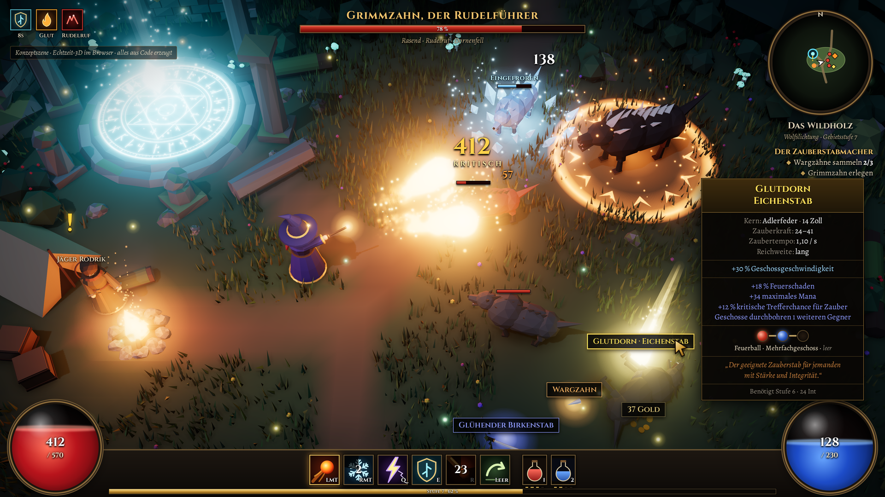

# Konzeptszene „Zauberstäbe“



Eine einzelne, statische 3D-Szene, die zeigt, wie das Zauberstäbe-RPG aussehen könnte.
Sie ist **nicht spielbar**: Es gibt noch keine Steuerung, keine Animationen und keine Spiellogik.

- **Technik:** Three.js (WebGL) im Browser, genau wie später im Spiel
- **Alles aus Code:** Figuren, Bäume, Ruinen, Effekte und Texturen werden prozedural erzeugt, es gibt keine fertigen Assets
- **Oberfläche:** HTML/CSS über der 3D-Szene (Lebens- und Manakugel, Zauberleiste, Tooltip, Minikarte)
- **Schriften:** Cinzel und Alegreya (SIL Open Font License, über `@fontsource`)

## Aufbau

| Datei | Inhalt |
| --- | --- |
| `src/main.js` | Szenenaufbau, Licht, Kamera, Nachbearbeitung (AO, Bloom) |
| `src/models.js` | Zauberer, Warge, Bäume, Felsen, Ruinen, Lager |
| `src/effects.js` | Feuerbälle, Explosion, Frostnova, Aura, Beute-Lichtsäule, Wegpunkt |
| `src/world.js` | Boden, Wege, Vegetation, Ruinen und Lager platzieren |
| `src/ui.js` | Lebensbalken, Schadenszahlen, Beute-Schilder, Minikarte |
| `render.mjs` | Startet einen Headless-Chromium und speichert den Screenshot |

## Screenshot neu erzeugen

```bash
npm install
node render.mjs screenshot.png            # 1920 × 1080
SCALE=2 node render.mjs shot_2x.png       # 3840 × 2160 (danach verkleinern = Kantenglättung)
node render.mjs test.png "?bloom=0&ao=0"  # Effekte zum Testen abschalten
```
