# UI-Stilfindung „Zauberstäbe“ — drei Varianten

Aufgabe 0.5 aus `PLAN.md`. Ziel: **eine** Stilrichtung für die gesamte Oberfläche festlegen,
bevor in Welle 2 das HUD, das Inventar und die Interaktionsfenster gebaut werden.

## Warum es diese drei gibt

Die Oberfläche der Konzeptszene hat dem Nutzer **„absolut nicht“** gefallen. Die wahrscheinlichen
Gründe, die alle drei Entwürfe abstellen:

| Problem der alten Oberfläche | Wie die drei Varianten damit umgehen |
| --- | --- |
| Zwei riesige Glaskugeln unten links und rechts (je 188 px) | **A** ersetzt sie durch eckige Balken oben links. **B** macht kleine, flache Kugeln daraus. **C** nimmt schmale Balken in der unteren linken Ecke. |
| Goldbraune Rahmen an praktisch jedem Element | **A** behält Holz, aber geordnet und nur an Fenstern. **B** hat überhaupt keine Rahmen, nur 1-px-Linien. **C** verzichtet ganz auf Gold und nimmt Moosgrün, Pergament, Glut und Rune. |
| Cinzel-Versalien in fast jedem Element | Keine Variante benutzt Cinzel. Versalien gibt es nur noch in kurzen Marken (z. B. „AUFGABE AKTUALISIERT“), nie in Fließtext oder Werten. |
| Sehr schwerer Tooltip | Alle drei zeigen den Tooltip **mit Vergleich zum getragenen Stab**, mit klarer Blockgliederung statt durchgehender Zentrierung. |
| Wenig freie Bildfläche | **B** gibt am meisten Bild frei, **C** liegt dazwischen, **A** ist am dichtesten — das ist bei WoW Classic so gewollt. |

Der Nutzer hat **WoW Classic** und **Diablo 4** als Vorbilder genannt. Daraus:
A ist WoW Classic, B ist Diablo 4, C ist die eigene Mischung.

## So sieht man sie an

```bash
cd ui-stile
npm install
npx playwright install chromium   # einmalig
node render.mjs                   # erzeugt alle 12 Screenshots
```

Im Browser lässt sich jede Variante direkt öffnen, die Szene steht in der Adresszeile:

```
a-classic/index.html?szene=hud | inventar | schriftrolle | wegweiser
```

`hintergrund.png` ist die Konzeptszene aus `konzept/`, **ohne** deren alte Oberfläche gerendert.
Deshalb liegt jeder Entwurf über dem echten Spielbild und nicht über einem Screenshot, in dem die
alte UI schon eingebrannt ist. `konzept/` selbst wird dabei nicht angefasst — der kleine Webserver
in `render.mjs` leitet alle `node_modules`-Anfragen nach `ui-stile/node_modules` um.

Alle Schriften stehen unter der **SIL Open Font License** und werden über `@fontsource` lokal
eingebunden: Marcellus, Source Sans 3, Spectral, Barlow Semi Condensed, Fraunces, Public Sans,
Noto Sans Runic.

---

## Die drei Varianten im Vergleich

| | **A — Classic** | **B — Modern** | **C — Wildholz** |
| --- | --- | --- | --- |
| **Vorbild** | WoW Classic | Diablo IV | eigene Mischung |
| **Grundstimmung** | warm, holzig, dicht, nostalgisch | schwarz, ruhig, zurückhaltend | geschnitzt, erdig, zweigeteilt |
| **Leben / Mana** | eckige Balken im Einheitenfenster **oben links**, Leben grün wie in Classic | kleine flache Kugeln **unten mittig**, links und rechts der Zauberleiste | schmale Balken mit abgeschrägten Enden **unten links** |
| **Zauberleiste** | 8 quadratische Felder, Tastenkürzel **in der Ecke des Feldes** | 7 flache Felder, Tastenkürzel **unter** dem Feld | 6 **Sechsecke**, Tastenkürzel darunter |
| **Gegnerleiste** | Zielfenster oben links, Elite-Marke, beschriftete Zustandsplaketten | dünne Leiste oben mittig, Zustände als Pillen | breite Leiste mit abgeschrägten Enden, Werte im Balken |
| **Minikarte** | **Viereck** mit Zonenbalken darüber und Fußleiste darunter | abgerundetes Rechteck, 1 px Linie, sehr leise | **Sechseck** mit Zonennamen darunter |
| **Questverfolgung** | Holzpanel rechts, linksbündig | nur Text, rechtsbündig, kein Panel | kleine **Pergamentnotiz** rechts |
| **Erfahrung** | volle Bildbreite unten, in 20 Blasen geteilt, violett | 3-px-Haarlinie am unteren Bildrand | 6-px-Balken unter Leben und Mana |
| **Fenster (Inventar, Rolle, Wegweiser)** | dunkles Holz, 2-px-Bronzerahmen | schwarzes Glas, 1-px-Linie | **helles Pergament mit dunkler Tinte** |
| **Rahmen** | 2 px Bronze + 1 px Schwarz + Lichtkante | genau 1 px, nie heller als 22 % Weiß | 2 px Dunkelgrün an Fenstern, sonst keine |
| **Radien** | 0 px (Symbolfelder 2 px) | 3–4 px | 2 px, dafür Sechsecke und Schrägen |
| **Überschriften** | Marcellus | Spectral 300, weit gesperrt | Fraunces 600, weich (`SOFT 40, WONK 1`) |
| **Fließtext** | Source Sans 3 | Spectral | Public Sans |
| **Akzentfarben** | Gold `#F0C860`, Grün, Blau, Violett | genau eine: `#D8B36A` | genau zwei: Glut `#FF9A3C`, Rune `#7FE0D2` |
| **Freie Bildfläche** | am wenigsten | am meisten | dazwischen |
| **Kleinster Text** | 11 px (Plaketten) | 11 px (Marken) | 11 px (Marken) |
| **Kontrast (gemessen)** | 5,1 : 1 bis 16,2 : 1 | 7,8 : 1 bis 15,8 : 1 | 5,1 : 1 bis 15,7 : 1 |

Alle drei halten **mindestens 4,5 : 1** für jeden Text ein. Die Werte stehen als Kommentar an
jeder Farbvariable im jeweiligen `style.css`.

---

## A — „Classic“

**Grundidee.** Die Oberfläche eines Spiels, das man 2006 gespielt hat: alles eckig, alles
beschriftet, nichts versteckt. Lieber eine Zeile zu viel als ein Symbol, das man raten muss.

**Prägende Entscheidung.** Es gibt keine Kugeln und keine Mitte-unten-Leiste als Schwerpunkt.
Statt dessen stehen **Einheitenfenster oben links**: ein Fenster für Alrik, darunter eins für das
Ziel, mit Bildnis, Stufe, Elite-Marke und **beschrifteten** Zustandsplaketten („Rasend“,
„Rudelruf“, „Dornenfell“). Das Spielerleben ist **grün**, nicht rot — das ist das deutlichste
Signal, dass hier WoW Classic Pate stand, und es trennt sofort eigenes Leben von Gegnerleben.
Dazu kommen zwei Dinge, die es in den anderen Varianten nicht gibt: eine **Kampfmitschrift** unten
links (man kann nachlesen, was passiert ist) und eine **EP-Leiste über die volle Bildbreite**, in
20 Blasen geteilt.

**Wovon sie sich absetzt.** Gegenüber der alten UI: keine Glaskugeln, kein Cinzel, kein Goldrahmen
an Einzelelementen. Das Gold bleibt, aber nur noch als Schriftfarbe für Überschriften und als
Fensterrahmen — nicht mehr um jedes Symbol herum. Gegenüber B und C: deutlich dichter, deutlich
mehr Text, deutlich wärmer.

| Kampf-HUD | Inventar mit Tooltip |
| --- | --- |
| 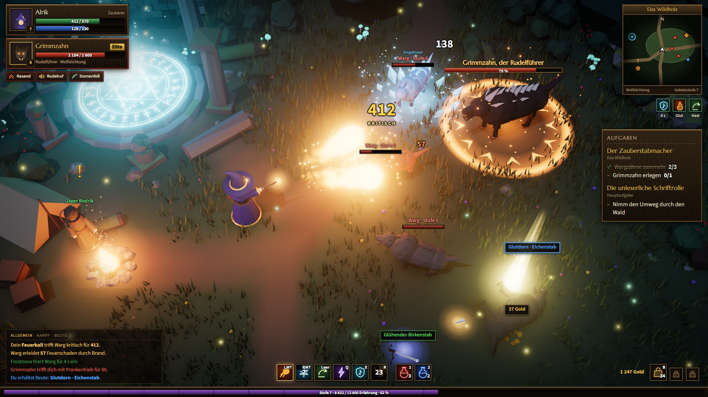 | 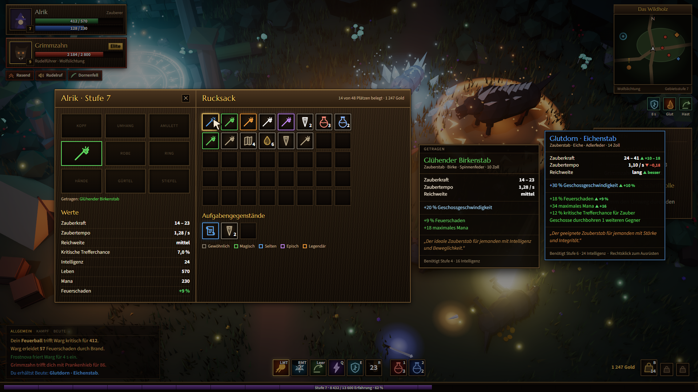 |
| **Pergament-Fenster** | **Wegweiser** |
| 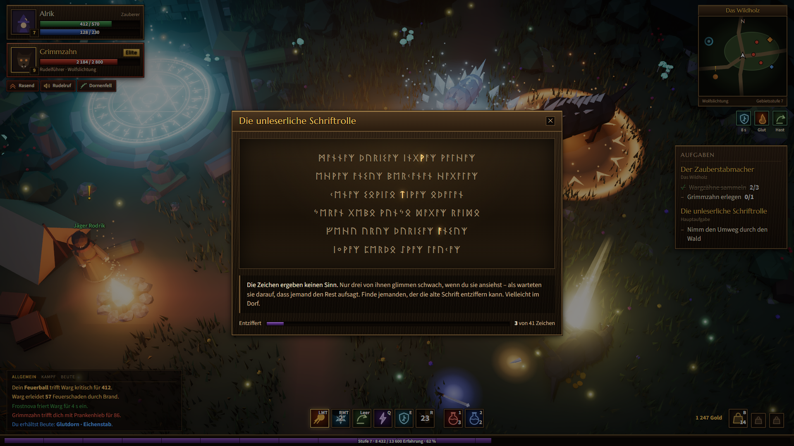 | 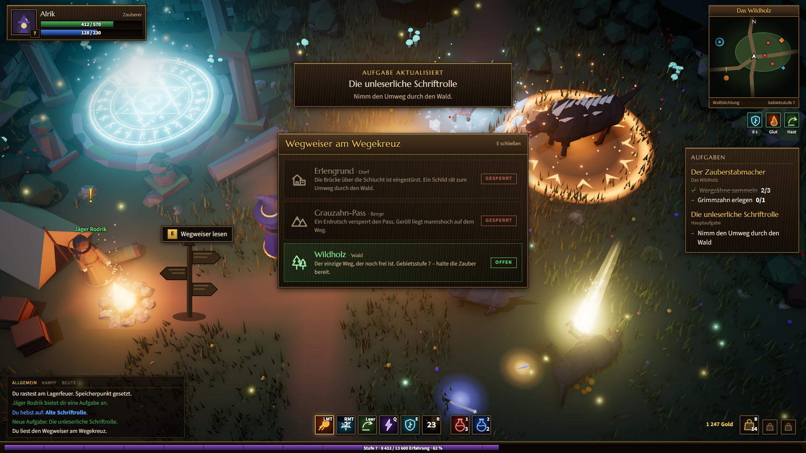 |

---

## B — „Modern“

**Grundidee.** Die Oberfläche soll so wenig wie möglich im Weg sein. Alles klebt an den Rändern,
die Mitte gehört dem Spiel. Was man im Kampf nicht braucht, ist nicht da.

**Prägende Entscheidung.** **Eine einzige Akzentfarbe** (`#D8B36A`) für die ganze Oberfläche,
alles andere ist Knochenweiß, Grau oder eine Zustandsfarbe. Dazu die Regel: Rahmen sind immer
genau 1 px und nie heller als 22 % Weiß. Keine Prägung, keine Lichtkante, kein Metall. Die
Lebenskugel ist flach gefüllt wie ein Messbecher, nicht wie eine Glasmurmel. Die Erfahrung ist
nur noch eine 3 px hohe Haarlinie am unteren Bildrand. Die obere linke Bildschirmecke ist
**vollständig leer** — das gibt es in keiner anderen Variante.

**Wovon sie sich absetzt.** Gegenüber der alten UI: das genaue Gegenteil. Statt Gold und Bronze
nur Schwarz und Knochen, statt dicker Rahmen Haarlinien, statt zweier 188-px-Kugeln zwei flache
104-px-Scheiben. Gegenüber A: etwa ein Drittel so viel belegte Bildfläche. Gegenüber C: keine
Sonderform, keine helle Fläche, nichts Handgemachtes — bewusst kühl.

| Kampf-HUD | Inventar mit Tooltip |
| --- | --- |
| 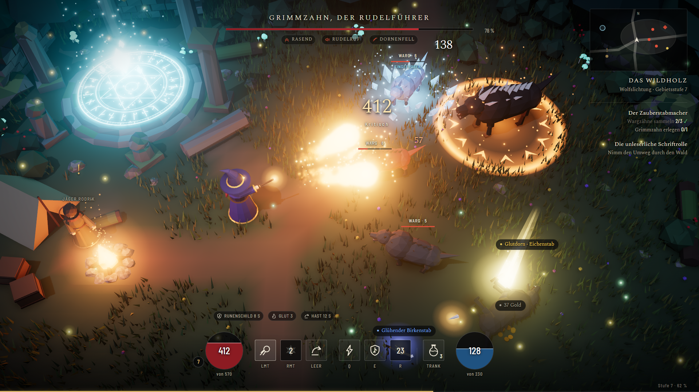 | 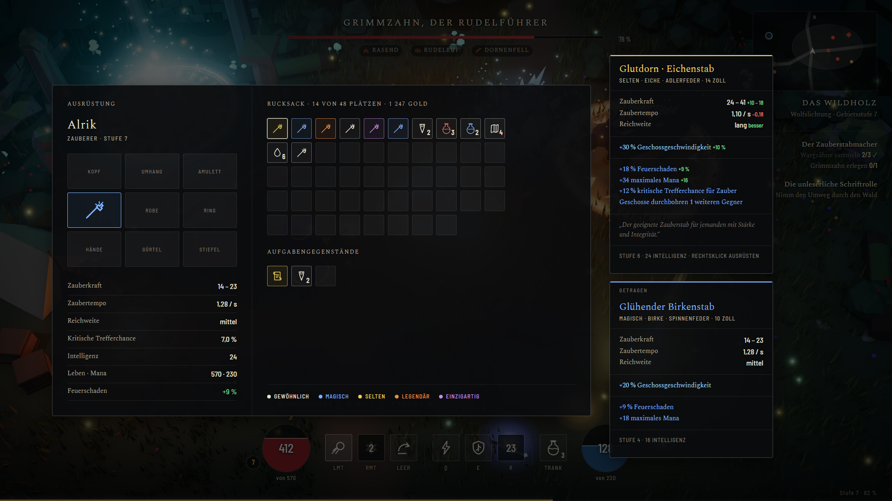 |
| **Pergament-Fenster** | **Wegweiser** |
| 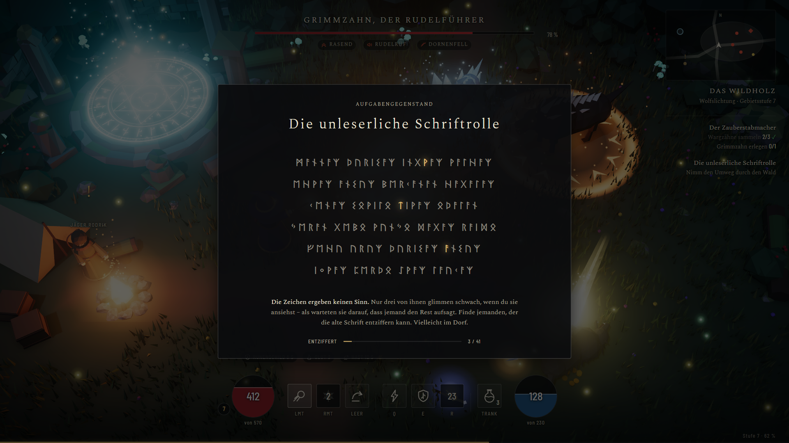 | 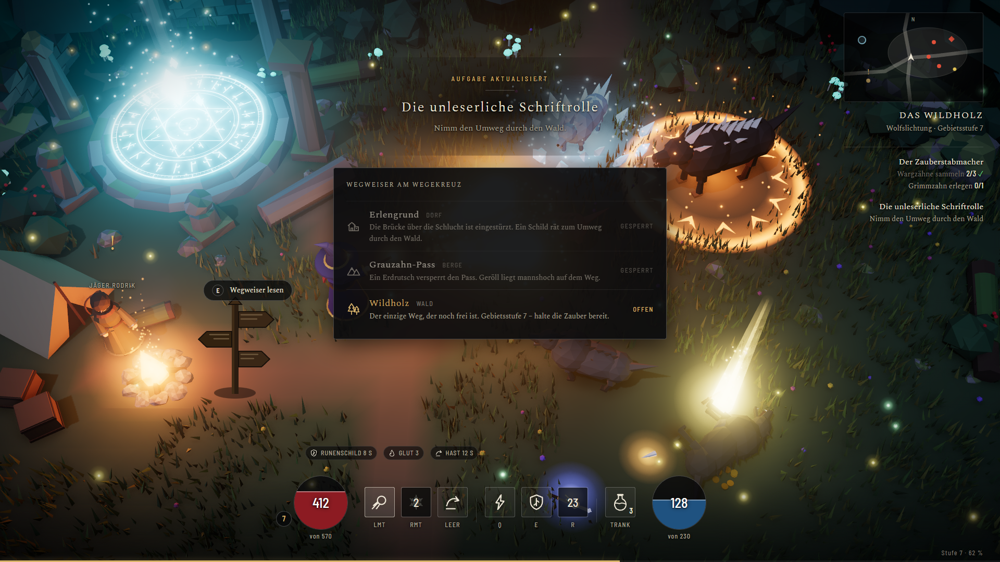 |

---

## C — „Wildholz“

**Grundidee.** Die Lesbarkeit von A und die Ruhe von B, plus etwas, das nur zu diesem Spiel
gehört. Keine Fantasy-Schablone, sondern zwei feste Regeln, aus denen sich alles andere ergibt.

**Prägende Entscheidung — zwei Stück.**

1. **Sechseck statt Quadrat.** Alles, was man anfassen kann — Zauber, Trank, Stufe, Minikarte,
   Zustandsmarke, sogar die `E`-Taste im Interaktionshinweis — ist ein Sechseck. Alles, was nur
   Zustand anzeigt, bleibt gerade, bekommt aber abgeschrägte Enden. Man erkennt ohne Hinsehen,
   was ein Knopf ist.
2. **Pergament statt Schwarzglas.** Jedes Fenster, das man in Ruhe liest — Inventar, Schriftrolle,
   Wegweiser, Tooltip, sogar die kleine Aufgabennotiz im HUD — ist **heller Pergamentgrund mit
   dunkler Tinte**. Das HUD selbst bleibt dunkel. Diese Umkehrung trennt „jetzt kämpfen“ und
   „jetzt lesen“ sofort voneinander, und sie bringt die mit Abstand höchsten Kontraste
   (13,2 : 1 für Fließtext im Inventar).

Deshalb führt der Stilleitfaden **zwei Seltenheitssätze**: einen für dunklen Grund (Beuteschilder
in der Welt) und einen für Pergament (Inventar, Tooltip). Beide sind geprüft, beide sind
untereinander klar unterscheidbar.

Die Farbwelt kommt ohne Gold aus: Moosgrün und Tinte als Flächen, Pergament als Papier,
**Glut** (`#FF9A3C`) für alles Warme und **Rune** (`#7FE0D2`) für alles Magische. Die Schrift
Fraunces läuft mit `SOFT 40, WONK 1` — die Buchstaben sind leicht schief, als wären sie
geschnitzt, ohne dass es wie eine Mittelalter-Schriftart aussieht.

**Wovon sie sich absetzt.** Gegenüber der alten UI: andere Farbfamilie, andere Grundform, andere
Schrift, umgekehrter Hell-Dunkel-Aufbau bei Fenstern. Gegenüber A: kein Holz, kein Gold, halb so
viel belegte Fläche. Gegenüber B: nicht neutral, sondern erkennbar dieses Spiel.

| Kampf-HUD | Inventar mit Tooltip |
| --- | --- |
| 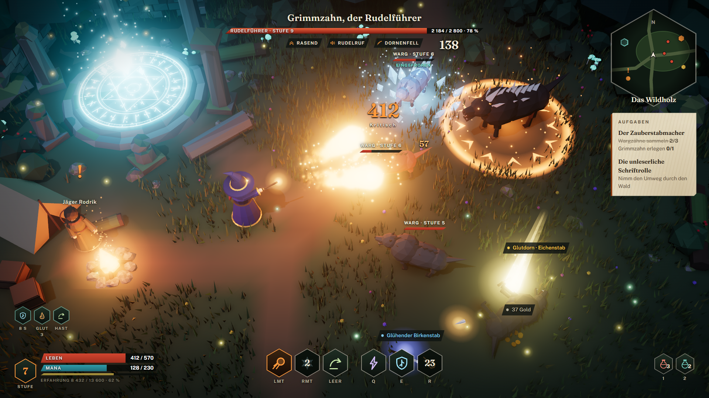 | 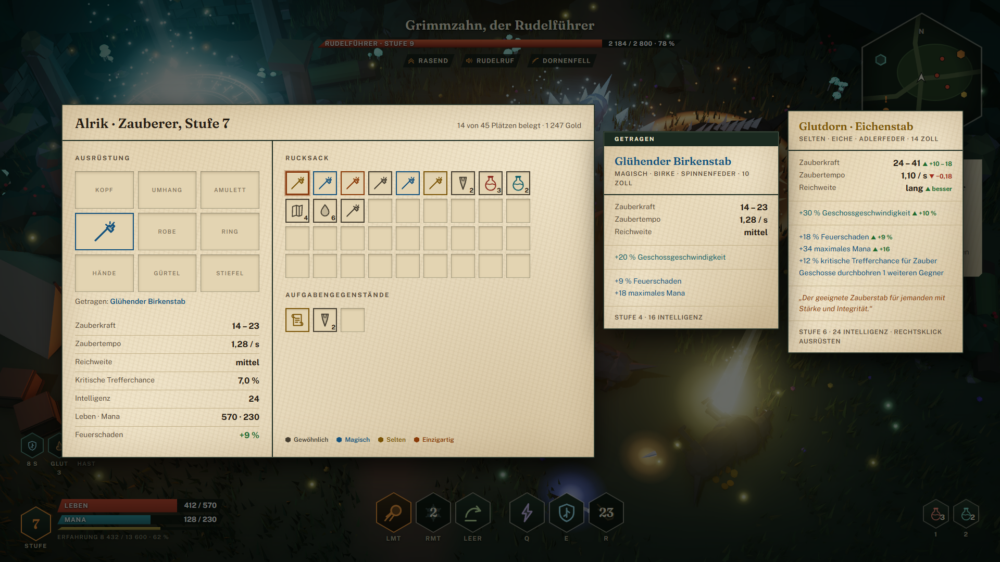 |
| **Pergament-Fenster** | **Wegweiser** |
| 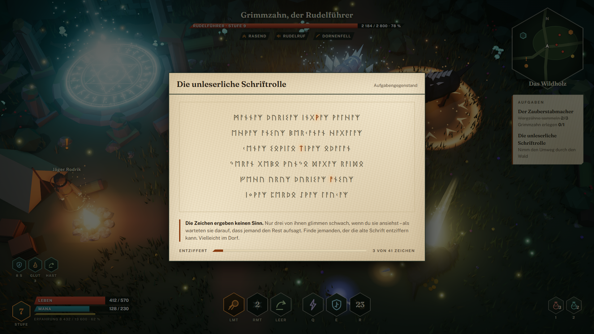 | 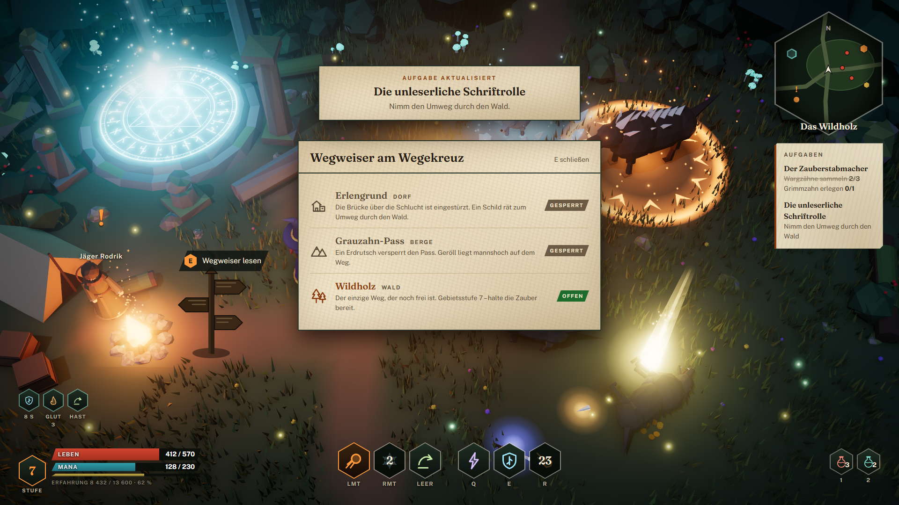 |

---

## Was in jeder Variante steckt

Damit der Vergleich fair ist, zeigen alle drei dieselben Inhalte mit denselben Zahlen:

- **Kampf-HUD:** Leben 412/570, Mana 128/230, Stufe 7 (62 % Erfahrung), Feuerball (LMT),
  Frostnova (RMT, 2 s Abklingzeit), Ausweichrolle (Leertaste), Kettenblitz (Q), Runenschild (E),
  Meteor (R, 23 s), Heil- und Manatrank, Schadenszahlen 412 kritisch / 57 Brand / 138,
  Lebensbalken dreier Warge, Boss **Grimmzahn, der Rudelführer** bei 78 % mit den Zuständen
  Rasend, Rudelruf und Dornenfell, Questverfolgung, Minikarte, Beuteschilder
- **Inventar:** Ausrüstungsplätze, getragener Stab, Taschenraster mit allen Seltenheitsstufen,
  Werteliste, und der Tooltip von **„Glutdorn · Eichenstab“** neben dem des getragenen
  **„Glühenden Birkenstabs“**, mit Veränderungen in Grün und Rot
- **Schriftrolle:** sechs Zeilen echter Runenzeichen (Noto Sans Runic), von denen genau **drei**
  schwach glimmen, dazu der Quest-Text und „3 von 41 Zeichen entziffert“
- **Wegweiser:** drei Arme — Erlengrund (Dorf, Brücke eingestürzt, gesperrt), Grauzahn-Pass
  (Berge, Erdrutsch, gesperrt), Wildholz (Wald, offen) — dazu der Hinweis `E Wegweiser lesen`
  am Objekt in der Welt und die Questaktualisierung

Die Daten der Zauberstäbe stammen aus `Zauberstabliste`:
„Ein Zauberstab aus **Eiche**, mit einer **Adlerfeder**, **14 Zoll**“ wurde zum seltenen
*Glutdorn · Eichenstab*, „aus **Birke**, mit einer **Spinnenfeder**, **10 Zoll“** zum magischen
*Glühenden Birkenstab*. Die Werte (Zauberkraft, Zaubertempo, Reichweite, Affixe) sind dazu
erfunden, aber in sich stimmig und in allen drei Varianten gleich.

## Der Stilleitfaden

Jede Variante bringt ihren Leitfaden als CSS-Variablen ganz oben in ihrer `style.css` mit:
Flächen, Linien, Schriftfarben mit gemessenem Kontrast, Zustandsfarben, Seltenheiten, Schriften
und Schriftgrößen, Abstandsraster (Vielfache von 4 px), Radien, Rahmen- und Schattenrezepte,
Standardgrößen der Bausteine. Wer später ein Fenster, eine Leiste oder einen Tooltip baut, nimmt
ausschließlich diese Variablen — damit ist der Leitfaden direkt übernehmbar.

## Empfehlung

**C — „Wildholz“**, falls der Nutzer keine andere Vorliebe hat. Sie erfüllt beide genannten
Vorbilder (Wärme und Lesbarkeit von Classic, Ruhe und Bildfreiheit von Diablo 4), hat die besten
Kontraste und ist die einzige Variante, die das Spiel von anderen Action-RPGs unterscheidbar
macht. **A** ist die sichere Wahl, wenn ihm die Classic-Nostalgie wichtiger ist als ein eigener
Auftritt. **B** ist die richtige Wahl, wenn die Grafik der Konzeptszene möglichst unverdeckt
wirken soll.

## Ablage

```
ui-stile/
  README.md         diese Datei
  render.mjs        erzeugt Hintergrundplatte und alle 12 Screenshots
  package.json
  hintergrund.png   Konzeptszene ohne alte Oberfläche (erzeugt, nicht von Hand gepflegt)
  a-classic/   index.html  style.css  screenshots/{hud,inventar,schriftrolle,wegweiser}.png
  b-modern/    index.html  style.css  screenshots/{hud,inventar,schriftrolle,wegweiser}.png
  c-wildholz/  index.html  style.css  screenshots/{hud,inventar,schriftrolle,wegweiser}.png
```
